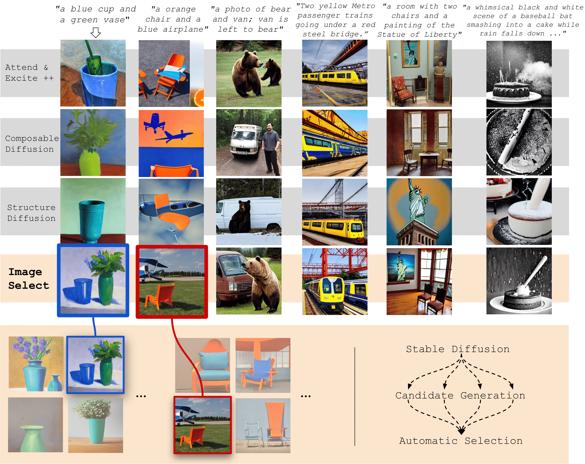

# Faithful Diffusion-based Text-to-Image Generation by Selection

This is the  PyTorch code our work [If at First You Don't Succeed, Try, Try Again: Faithful Diffusion-based Text-to-Image Generation by Selection](https://arxiv.org/abs/2305.13308) .

<p align="center">
  
</p>

## Setup

You can setup the environments required by [Stable Diffusion](https://huggingface.co/blog/stable_diffusion) and [ImageReward](https://github.com/THUDM/ImageReward)


## Demo
To generate an image for a given prompt, all you need to do is create the directories `./all_images` and `./best_images` and then run the command `python3 src/imageselect_demo.py --num_seeds <num_imgs_generated> --prompt <prompt>`. The best image selected by ImageReward will be saved in the directory `./best_images`. 

## Diverse1k Dataset
The prompts for the `Diverse1k` dataset can be found in `./data/1k_prompts.json` and the corresponding QA data (which can be used for the [TIFA](https://github.com/Yushi-Hu/tifa) evaluation) collected from GPT3.5 is provided in `./data/qa.json`. 


## References
If you find this work useful, please cite:
```
@article{karthik2023if,
  title={If at First You Don't Succeed, Try, Try Again: Faithful Diffusion-based Text-to-Image Generation by Selection},
  author={Karthik, Shyamgopal and Roth, Karsten and Mancini, Massimiliano and Akata, Zeynep},
  journal={arXiv preprint arXiv:2305.13308},
  year={2023}
}
```